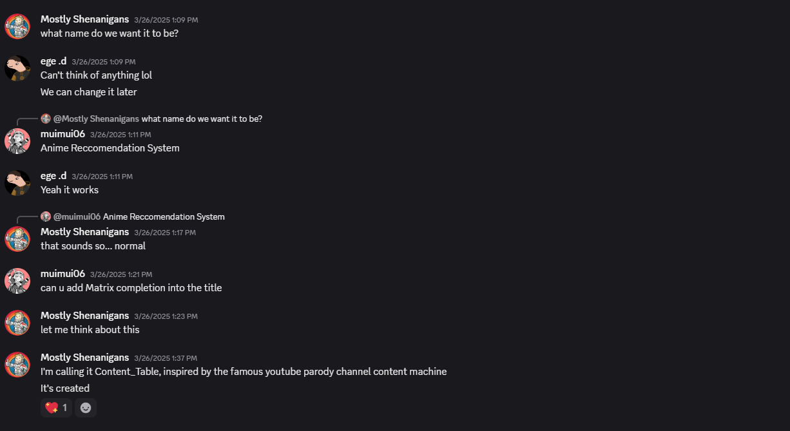

## About the Project

This project was developed as a final submission for **: Convex Optimization** at a 4th year University Operations Research Course. It explores the application of matrix completion techniques for building an content recommendation system.

Inspired by the mathematical foundations laid out in academic literature, the project implements and compares four core models:

- **Baseline Model**: Captures user and item biases using convex regression
- **ℓ2-Regularized Matrix Factorization (ALS)**: Learns latent user–item features through alternating least squares
- **Spectral Regularization**: Combines least squares error with nuclear norm penalty
- **Nuclear Norm Minimization**: Recovers a low-rank matrix consistent with known ratings via convex optimization

---

## Dataset

The dataset was derived from [MyAnimeList on Kaggle](https://www.kaggle.com/datasets/marlesson/myanimelist-dataset-animes-profiles-reviews). Due to hardware constraints, it was filtered down to a **100×100 matrix**—100 users and 100 anime—with non-zero entries representing observed ratings.

---

## File Overview

| File / Notebook / Folder         | Description                                                                 |
|----------------------------------|-----------------------------------------------------------------------------|
| `content_table.py`               | Main module that contains **all model implementations**, including ALS, Baseline, Spectral Reg., Nuclear Norm, along with utility functions like RMSE and recommender logic. |
| `main_recommender.ipynb`         | Demonstration notebook that shows how to train each model and generate top-N anime recommendations for specific users. |
| `main_compare_models.ipynb`      | Evaluation notebook that compares models by computing **RMSE on a held-out test set** using the split datasets. |
| `data`                           | Training dataset, downloaded and derived from MyAnimeList. |
| `models`                         | Implementation progress files for each indivdiaul models and . |
| `README.md`                      | Project overview, model summaries, instructions, and credits (this file). |

---

## Results at a Glance

| Model                        | RMSE (Dataset 1) | RMSE (Dataset 2) |
|-----------------------------|------------------|------------------|
| Baseline                    | 1.495            | 1.566            |
| ℓ2-Regularized Matrix Fact. | 0.0177           | 0.0216           |
| Spectral Regularization     | 0.744            | 0.939            |
| Nuclear Norm Minimization   | ~0 (1e-9)         | ~0 (1e-9)         |

- **ALS** and **Nuclear Norm** models achieved the best RMSE but risk overfitting.
- **Spectral model** produced diverse and stable recommendations.
- **Baseline** served as a reliable benchmark capturing global popularity.

---

## Frequently Recommended Titles

Models often recommended:
- *Gekkan Shoujo Nozaki-kun*
- *Azumanga Daioh*
- *Psycho-Pass*
- *Mob Psycho 100 II*
- *Clannad: After Story*
- *Perfect Blue*

---

## Takeaways

This project blends **convex optimization theory**, **linear algebra**, and **machine learning** to build interpretable and mathematically sound recommender models. Beyond implementing algorithms, we explored:

- The trade-off between bias-based and low-rank models
- Model interpretability and overfitting in sparse data
- Collaborative filtering without external metadata

We hope this serves as a resource and inspiration for others interested in bridging applied mathematics and pop culture media.

